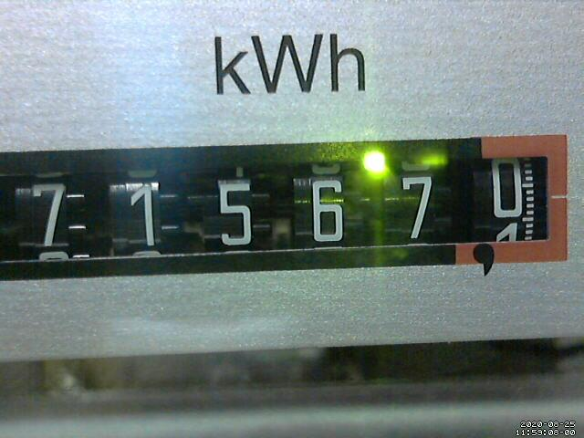
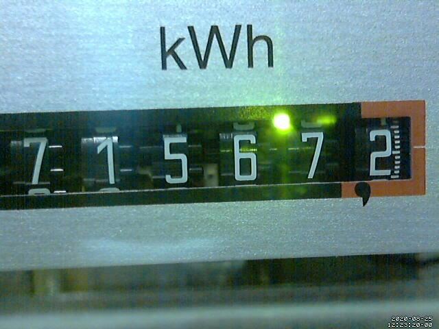
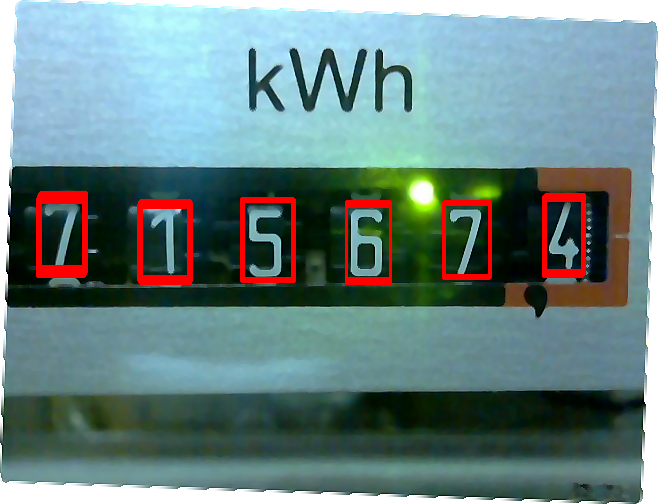

# Rotating numbers recognition using OpenCV matchTemplate

Goal: capture the image from the webcam and recognize the digits on the analog energy meter.

Source:

## Step 1

Denoise and rotate the source image from the webcam.

	convert /var/motion/lastsnap.jpg -rotate 2 -auto-level -auto-gamma -noise 5 -median 5 -unsharp 5 -normalize /var/motion/output.png

Result:

## Step 2

Prepare cut-out images for each digit.

## Step 3

Run python script to find the rectangles for each digit.

The rectangles needs to be sorted from left to right.

The rectangles in order give away the numbers detected.

