# Rotating numbers recognition using OpenCV matchTemplate

Goal: capture the image from the webcam and recognize the digits on the analog energy meter.

Source:

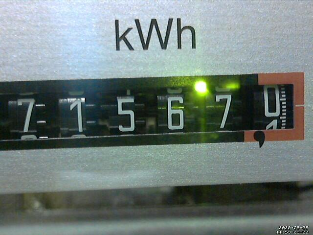

## Step 1

Denoise and rotate the source image from the webcam.

	convert /var/motion/lastsnap.jpg -rotate 2 -auto-level -auto-gamma -noise 5 -median 5 -unsharp 5 -normalize /var/motion/output.png

Result:

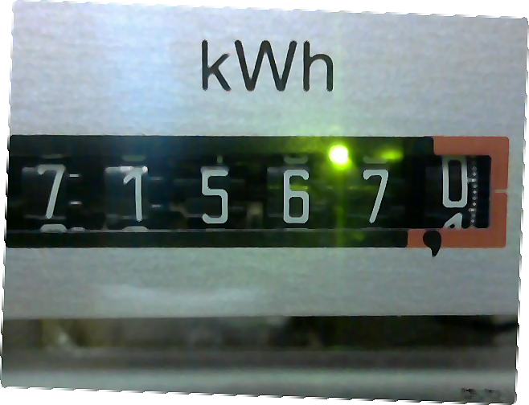

## Step 2

Prepare cut-out images for each digit.

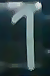
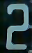

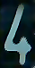
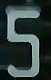
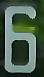
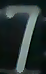

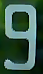

## Step 3

Run python script to find the rectangles for each digit.

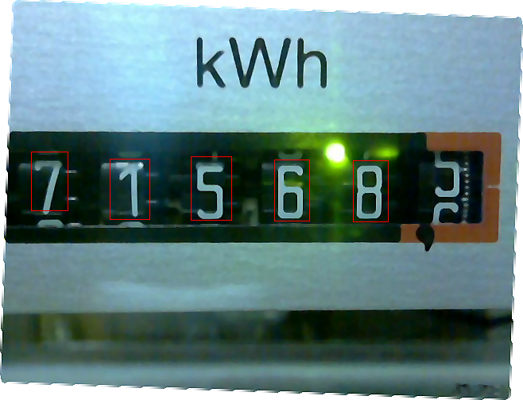

The rectangles need to be sorted from left to right.
The rectangles in order from left to right give away the numbers detected.

[Example output from the detector](docs/python.txt)

## Step 4

Install redis database that will store the recognized data.

    sudo apt install redis

## Step 5

Create a script that will process every image file, denoise it, run the recongnition from Step 3 and store the result into the redis database.

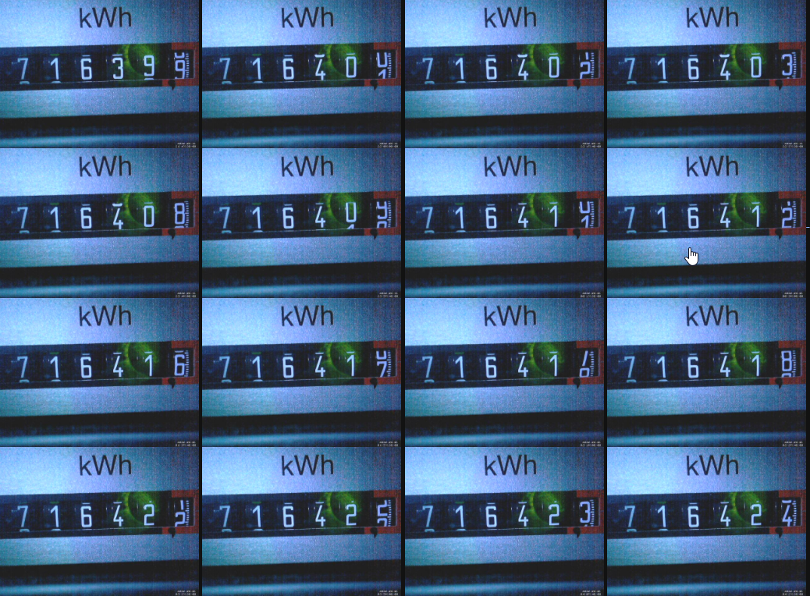

## Step 6

Run PHP application that would display the values from redis database in a nice daily/monthly chart.

Profit!

